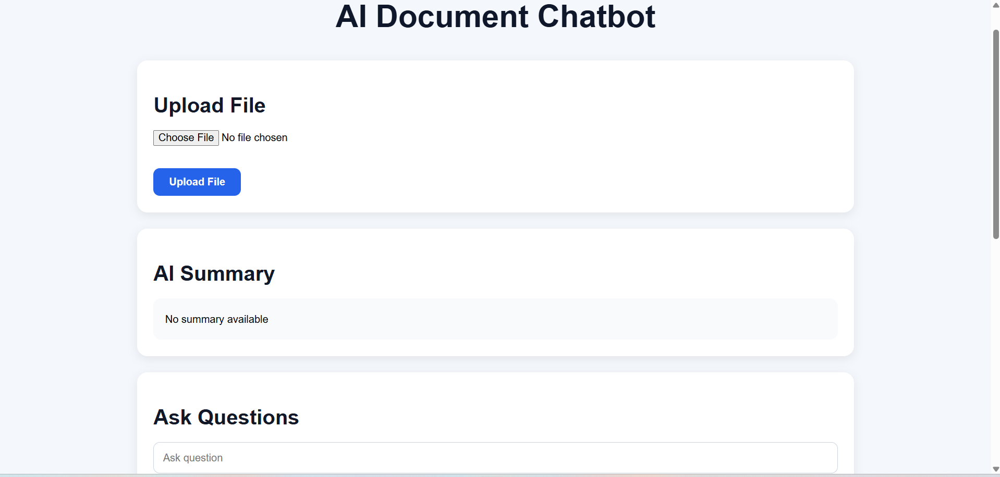
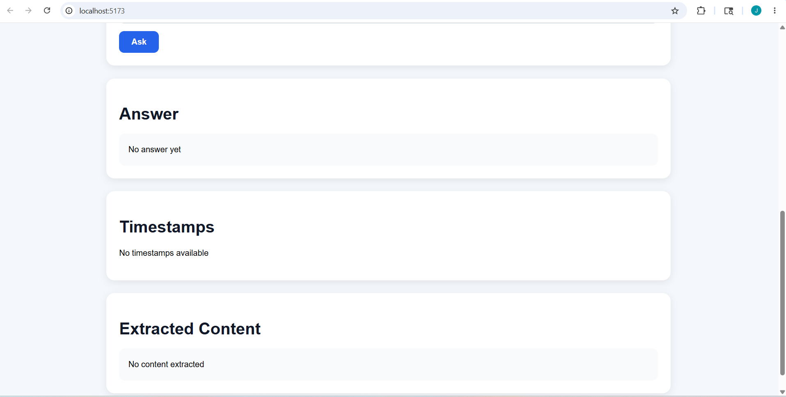
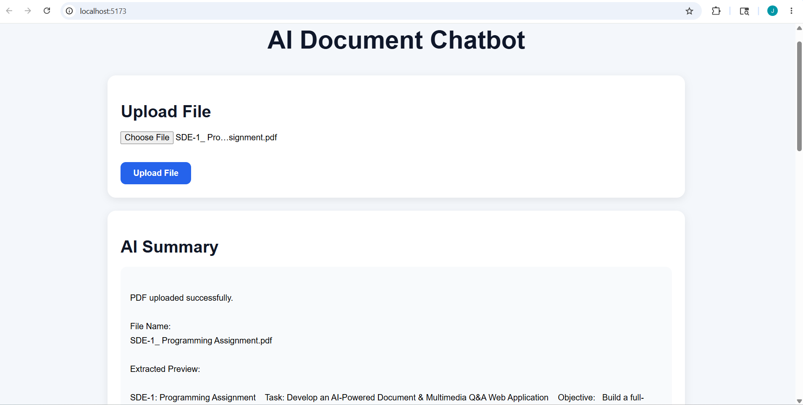
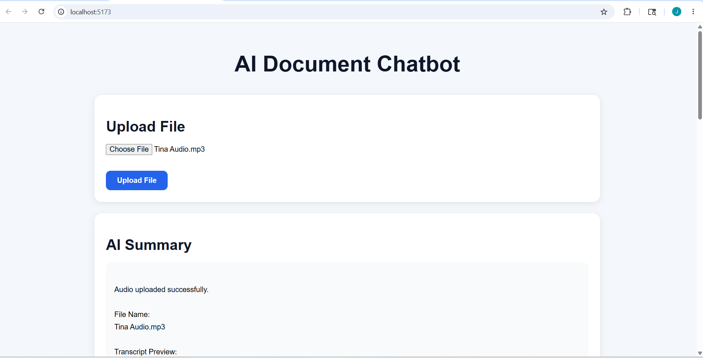
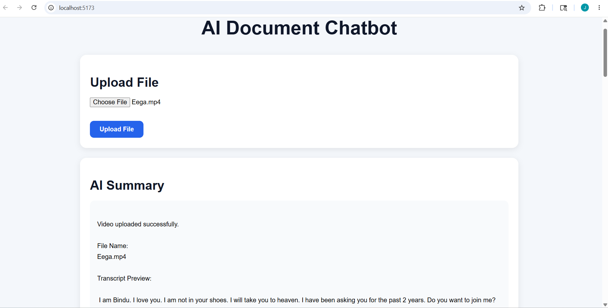
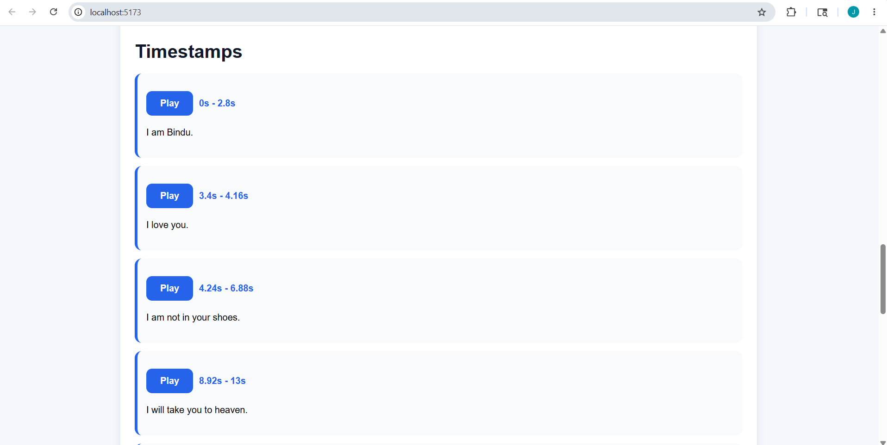

# AI Document & Multimedia Q&A Web Application

## Project Overview

This project is an AI-powered full-stack web application that allows users to upload PDF documents, audio files, and video files and interact with them using an AI chatbot.

The application supports:

- PDF upload and text extraction
- Audio/video transcription using Whisper AI
- AI summaries
- Timestamp extraction
- Media playback from timestamps
- Semantic search using FAISS
- Question answering

---

# Features

## PDF Processing

- Upload PDF files
- Extract document text
- Generate summaries
- Ask questions from document content

## Audio Processing

- Upload MP3/WAV files
- Whisper AI transcription
- Timestamp extraction
- Audio playback

## Video Processing

- Upload MP4/MOV/AVI files
- Extract audio from video
- Whisper AI transcription
- Timestamp extraction
- Video playback

## AI Chatbot

- Semantic search using FAISS
- Question answering
- AI-generated summaries

## Database

- SQLite database using SQLAlchemy

---

# Tech Stack

## Backend

- FastAPI
- Python
- Whisper AI
- FAISS
- SQLAlchemy
- SQLite
- MoviePy
- PyMuPDF

## Frontend

- React.js
- Axios
- HTML5 Audio/Video

---

# Project Structure

```bash
ai-doc-chatbot/
│
├── .github/
│   └── workflows/
│       └── main.yml
│
├── backend/
│   ├── app/
│   │   ├── main.py
│   │   ├── database.py
│   │   ├── models.py
│   │
│   ├── uploads/
│   ├── requirements.txt
│
├── frontend/
│   ├── src/
│   │   ├── App.jsx
│   │   ├── App.css
│   │   ├── main.jsx
│
├── Screenshots/
│   ├── Home1.png
│   ├── Home2.png
│   ├── Audio.png
│   ├── Video.png
│   ├── pdf.png
│   ├── Timestamps.png
│
├── docker-compose.yml
├── README.md
├── .gitignore
```

---

# Screenshots

## Home Page





---

## PDF Upload



---

## Audio Upload



---

## Video Upload



---

## Timestamp Playback



---

# Backend Setup

```bash
cd backend
```

Create virtual environment:

```bash
python -m venv venv
```

Activate virtual environment:

```bash
venv\Scripts\activate
```

Install dependencies:

```bash
pip install -r requirements.txt
```

Run backend:

```bash
uvicorn app.main:app --reload
```

Backend URL:

```bash
http://127.0.0.1:8000
```

---

# Frontend Setup

```bash
cd frontend
```

Install dependencies:

```bash
npm install
```

Run frontend:

```bash
npm run dev
```

Frontend URL:

```bash
http://localhost:5173
```

---

# API Endpoints

## Upload File

```bash
POST /upload
```

Supported files:

- PDF
- MP3
- WAV
- MP4
- MOV
- AVI

---

## Chatbot

```bash
POST /chat
```

Example:

```json
{
  "question": "What is the document about?"
}
```

---

# Authentication

Example API key:

```bash
x-api-key: raju123
```

---

# Semantic Search

FAISS vector search is used for semantic retrieval of document chunks.

---

# Docker Support

```bash
docker-compose up --build
```

---

# GitHub Actions

Workflow file:

```bash
.github/workflows/main.yml
```

---

# Future Improvements

- OpenAI GPT integration
- JWT authentication
- Redis caching
- Pinecone vector database

---

# Author

## Jallela Raju
